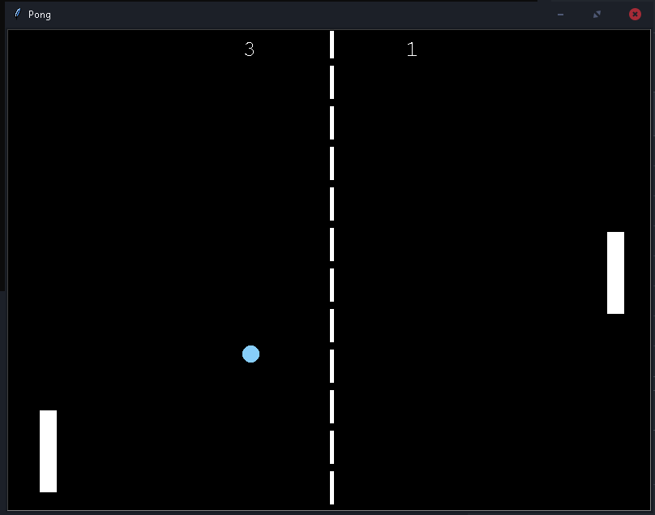

# Pong

Aslan Taleb

This Pong Game  was made using Python and Turtle.

# Setup:

to run the game : 

 •download the game folder. ( a Download Link : (https://minhaskamal.github.io/DownGit/#/home?url=https://github.com/Aslan-Taleb/100Days100Projects/tree/main/21.Pong-Game) )

   ➝you will need to download 'requirements.txt' :  
  
   ➝type this command in the command prompt : "pip install -r requirements.txt"
  
Enjoy the game ;)
