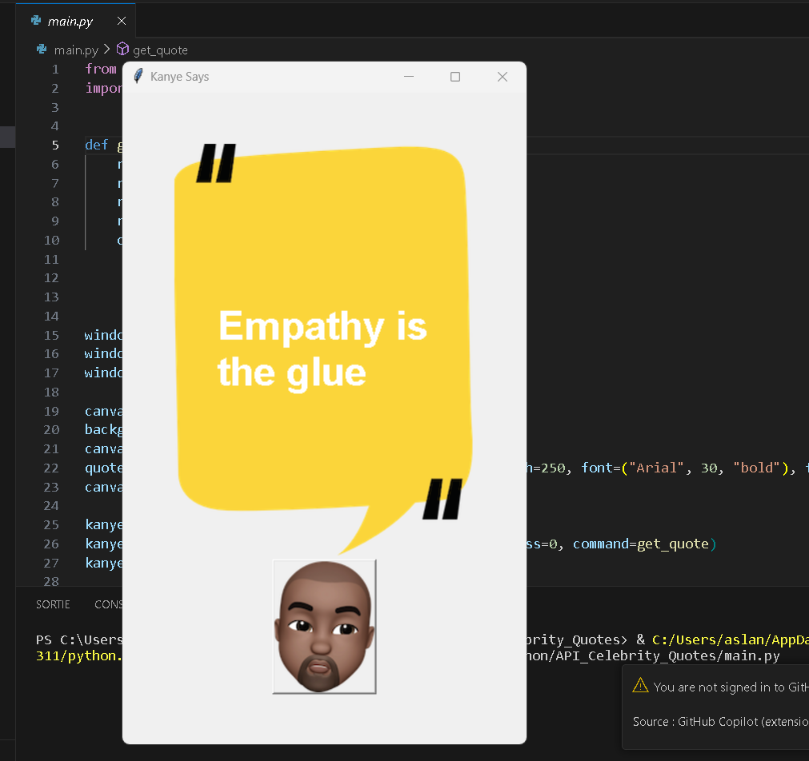

# Kanye Says

Kanye Says is a simple Python application that fetches and displays random Kanye West quotes using the Kanye REST API. This application is built using the Tkinter library for the graphical user interface.

## Screenshots

## Prerequisites

Before you run this application, make sure you have the following installed:

- Python 3.x
- Requests library
- Tkinter library (usually comes pre-installed with Python)

## Installation

1. Clone this repository to your local machine or download the ZIP file.

2. Navigate to the project directory.

3. Run the application.

## Usage

- Click the "Kanye Says" button to fetch and display a random Kanye West quote on the graphical user interface.

## Acknowledgments

- Kanye REST API: [https://api.kanye.rest/](https://api.kanye.rest/)

