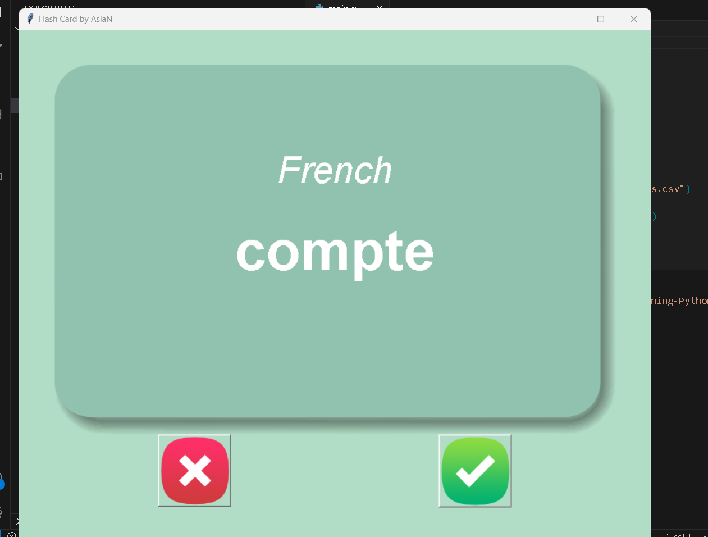

# Flash Card Application

The Flash Card Application is a Python program that helps users learn new words or phrases in a foreign language. It presents a card with the English word on one side and the corresponding translation in French on the other side. Users can flip the card to see the translation and mark it as "known" or "unknown."

## Screenshots : 

## Features

- Display a flash card with English and French words.
- Users can flip the card to see the translation.
- Mark cards as "known" or "unknown."
- Automatically saves progress to a CSV file for future learning.

## Prerequisites

Before running this script, ensure you have Python installed on your computer. You'll also need the following:

- Python's `pandas` library for data manipulation.
- The flash card data in CSV format (e.g., `data/french_words.csv`).
- Images for the front and back of the flash card (e.g., `images/card_front.png` and `images/card_back.png`).

## Usage

The program will display a flash card with the English word on one side.

Click the "Show Answer" button to reveal the French translation.

Click the "Known" or "Unknown" button to mark the card accordingly.

The program will automatically save your progress to a CSV file.

Click the "Next Card" button to move on to the next word.

## Important Note

Customize the script with your own flash card data and image paths. You can also adjust the flip timer (currently set to 3 seconds) in the script.
