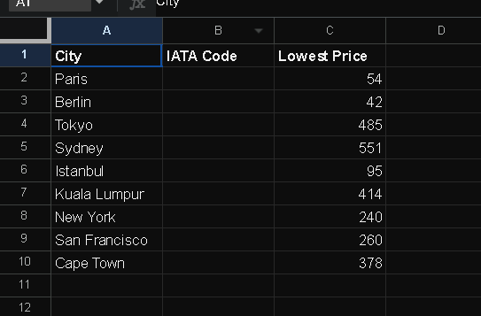

# Flight Deal Finder

This application helps you find the best flight deals from your current location to multiple destinations. It utilizes various APIs and data sources to provide you with real-time information about flight prices.

## Features

- Search for flight deals from your current location to specified destinations.
- Receive notifications about low-price flight deals via SMS.
- Automatically update flight prices in a Google Sheets document.
- Flexible configuration for specifying destinations and API credentials.

## Getting Started

### Prerequisites

- Python 3.x
- pip (Python Package Manager)

## Usage

Open the flight_search.py file and specify your API key for the flight search service.

Modify the CURRENT_POSITION variable to your current location IATA code.

Update the WHERE_TO_GO list with the IATA codes of the destinations you want to search for flight deals.

## Screenshot

## APIs Used

Tequila Kiwi API

Sheety API
