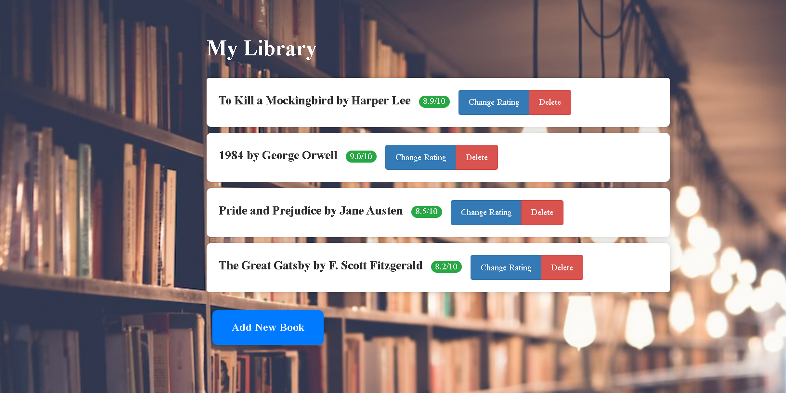

# Book Collection Web App

This is a simple Flask web application that allows you to manage a collection of books. You can add, edit, and delete books from your collection.

## Screenshot

## Features

- View a list of all books in your collection.
- Add new books with a title, author, and rating.
- Edit the rating of existing books.
- Delete books from your collection.

## Prerequisites

Before you begin, ensure you have met the following requirements:

- Python installed.
- Flask installed. You can install it using `pip install Flask`.
- SQLAlchemy installed. You can install it using `pip install SQLAlchemy`.
- Bootstrap for Flask installed. You can install it using `pip install Flask-Bootstrap`.

## Usage

Visit http://127.0.0.1:5000/ in your web browser to access the web app.

You can view, add, edit, and delete books from your collection.

