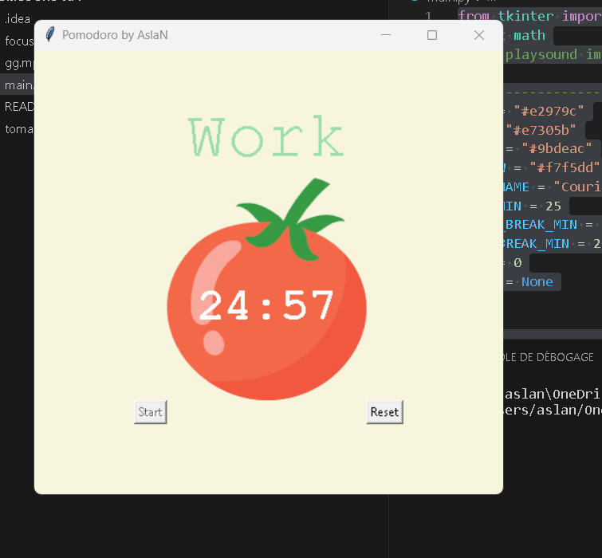

# Pomodoro Timer

This is a Python program that implements a simple Pomodoro timer using the Tkinter library. The Pomodoro Technique is a time management method that uses a timer to break work into intervals, traditionally 25 minutes in length, separated by short breaks. This technique is designed to improve productivity and focus.

## Requirements

- Python 3.x
- Tkinter library (usually comes pre-installed with Python)

## Usage

Upon running the script, a window will appear displaying the Pomodoro timer.

Click the "Start" button to begin a work session. The default work duration is 25 minutes.

After the work session is complete, the timer will automatically switch to a short break (5 minutes) or a long break (20 minutes) based on the number of work sessions completed.

The title will indicate whether it's a "Work" or "Break" session, and the timer will show the remaining time.

You can click the "Reset" button at any time to stop the timer and reset it to the initial state.

During work sessions, you can see checkmarks accumulating below the timer, indicating completed work sessions.

## Features

Configurable work duration (default: 25 minutes), short break (default: 5 minutes), and long break (default: 20 minutes).

Automatic switch between work and break sessions.

Accumulation of checkmarks to track completed work sessions.

Simple and intuitive user interface.

## Customization
You can customize the timer by modifying the following constants in the script:

WORK_MIN: Duration of a work session in minutes (default: 25).

SHORT_BREAK_MIN: Duration of a short break in minutes (default: 5).

LONG_BREAK_MIN: Duration of a long break in minutes (default: 20).

PINK, RED, GREEN, YELLOW: Colors used for UI elements.

FONT_NAME: Font used for text.

tomato_img: Image file used for the tomato icon (replace "tomato.png" with your own image if desired).
