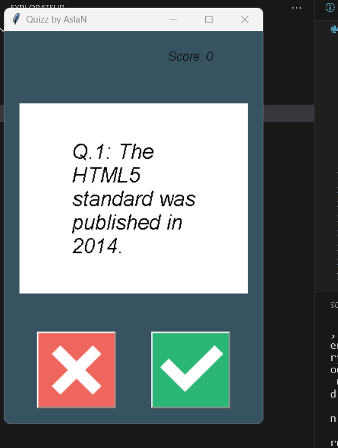

# Quiz App

This Python script creates a quiz app by using a list of questions and a graphical user interface (UI). It allows users to answer multiple-choice questions and see their final score at the end.

## Screenshots

## Prerequisites

Before you begin, ensure you have met the following requirements:

- Python installed on your machine.
- The required Python files (`question_model.py`, `data.py`, `quiz_brain.py`, and `ui.py`) in the same directory.

## Usage Notes

You can customize the quiz questions and answers by modifying the question_data dictionary in the data.py file.
The script uses the tkinter library for the graphical user interface (UI), so make sure you have it installed (pip install tk).

The script provides basic error handling and tracks your score as you progress through the quiz.

Customize the UI and script as needed for your specific requirements.

