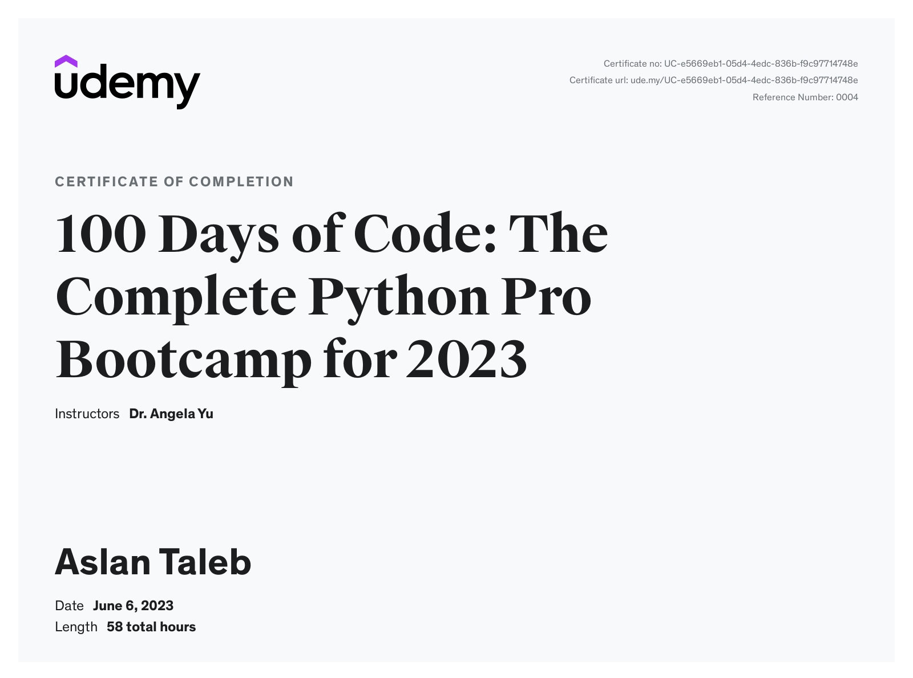

<h1 align="center">Learning-Python 🐍 
</h1>

I completed the "100 Days of Code - The Complete Python Pro Bootcamp for 2023" course on Udemy. This course perfectly aligned with my goal of mastering Python. Additionally, I worked on personal projects and solved LeetCode exercises to improve my skills.

In my GitHub repository, I've included only the projects I developed individually, and I believe they're suitable for showcasing in a portfolio.

You can also check out my portfolio website: [here](https://aslan-taleb.onrender.com/). Please note that the website might take around 5-6 seconds to load initially, so your patience is appreciated.

## My Certification: 

Really recommend it:
[100 Days of Code - The Complete Python Pro Bootcamp for 2023](https://www.udemy.com/course/100-days-of-code).

## Tools and technologies : 

- Python 3
- PyCharm, Jupyter Notebook, Google Colab
- Python Scripting and Automation
- Python Game Development
- Web Scraping
- Beautiful Soup
- Selenium Web Driver
- Request
- WTForms
- Data Science
- Pandas
- NumPy
- Matplotlib
- Plotly
- Scikit learn
- Seaborn
- Turtle
- Python GUI Desktop App Development
- Tkinter
- Front-End Web Development
- HTML 5
- CSS 3
- Bootstrap 4
- Bash Command Line
- Git, GitHub and Version Control
- Backend Web Development
- Flask
- REST
- APIs
- Databases
- SQL
- SQLite
- PostgreSQL
- Authentication
- Web Design
- Deployment with GitHub Pages, Heroku and GUnicorn

---

@Aslan-Taleb 🐍 2023
