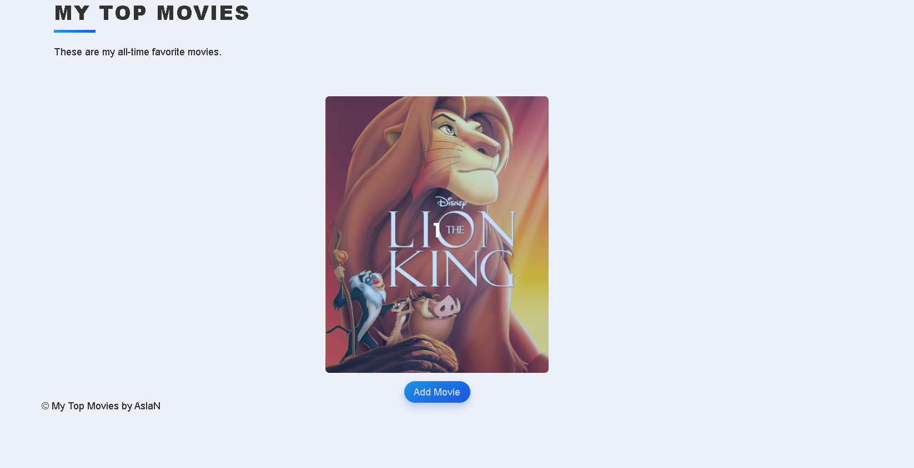

# Movie Rating Web App

This is a Flask web application that allows you to manage and rate movies. You can add, edit, and delete movies from your collection and provide ratings and reviews for each movie.

## Screenshot

## Features

- View a list of all movies in your collection.
- Add new movies by searching for them using their title.
- Edit the ratings and reviews for existing movies.
- Delete movies from your collection.

## Prerequisites

Before you begin, ensure you have met the following requirements:

- Python installed.
- Flask installed. You can install it using `pip install Flask`.
- Flask Bootstrap installed. You can install it using `pip install Flask-Bootstrap`.
- Flask SQLAlchemy installed. You can install it using `pip install Flask-SQLAlchemy`.
- Flask WTF Forms installed. You can install it using `pip install Flask-WTF`.
- An API key from [The Movie Database (TMDb)](https://www.themoviedb.org/). Replace `API_KEY` in the code with your TMDb API key.

## Usage

Visit http://127.0.0.1:5000/ in your web browser to access the web app.

You can view, add, edit, and delete movies from your collection.

